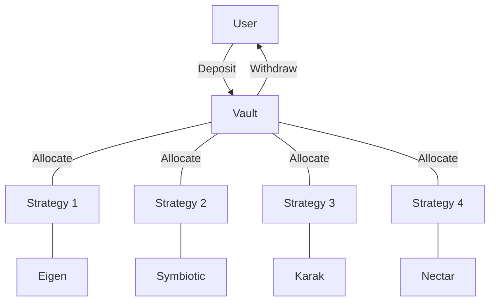
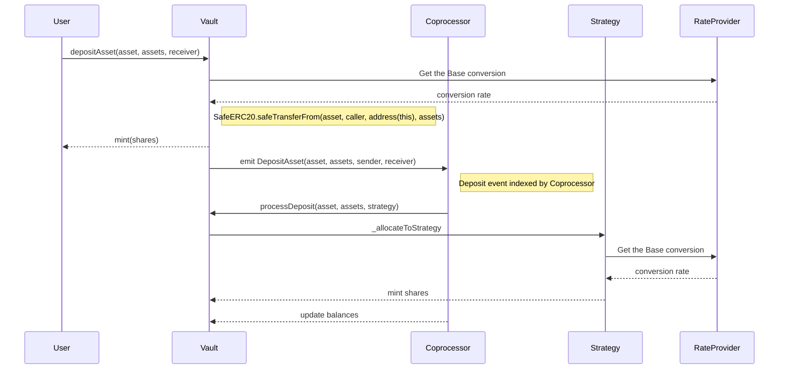

DeFi Vault Architecture
---

The vault architecture seamlessly integrates with DeFi opportunities that return yield in crypto-native base assets. There are two types of Vault, the deposit Vault and the Strategy. YieldNest has planned to launch 5 vaults; ynETH, ynLSD, ynUSD, ynBTC and ynBNB. Vaults are 4626 compatible vaults denominated in a major base asset, such as ETH, BTC or USD. Users deposit underlying assets into the Vaults and receive share tokens. The Vaults are denominated in major base assets, but accept various underlying deriviative assets such as stETH, mETH, oETH, USDS, slisBNB, accordingly.

The Strategies live downstream of the Vaults and do the hard work of integrating with Defi protocols, such as Eigen Layer, Symbiotic, Aave, among many others. Deposits into Vaults are allocated to the Strategies which allocate to restaking protocols via  connectors.

This is a diagram of the relationship between Vaults and Strategies:

Deposits
---

The deposit process in this system is designed to efficiently manage user assets through a structured flow involving multiple components. Users initiate the process by transferring their assets to a central storage unit known as the "Vault." The Vault, which can handle multiple deposit assets, utilizes a standard method (ERC4626) to ensure compatibility with various assets. It coordinates with a Coprocessor to track deposit events and determine asset allocation strategies. The Strategy then receives and distributes these assets according to a predetermined plan, with the Rate Provider ensuring accurate conversion rates throughout the process. This comprehensive system ensures that all transactions are secure, accurately processed, and effectively managed.

### Deposit Components

1. **The Vault**:
   - The Vault is the product contract that represents shares and accounting.
   - It's a multi-asset deposit vault that converts deposited underlying assets holdings into a common share token.
   - It uses a standard method (ERC4626) to ensure compatibility accross Defi and tokenize user shares.

2. **Functions of the Vault**:
   - **deposit**: Allows users to deposit assets directly.
   - **depositAsset**: Handles deposits involving multiple types of assets.
   - **totalAssets**: The vault holds multi assets and total assets is denominated in the base asset.
   - **asset**: Vaults have a base asset used to denominate asset holdings in a common price.
   - **withdraw**: Enables users to withdraw assets from the vault.
   - **withdrawAsset**: Facilitates withdrawals involving multiple types of assets.
   - **processAccounting**: Updates the accounting for the vault by recalculating the total assets and asset balances.
   - **processAssets**: Moves assets from the vault to the strategies.

3. **Coprocessor**:
   - Keeps track of deposit events and runs process functions on the vaults and strategies.
   - Calls process functions to distribute assets to different strategies for investment.
   - Updates the Vault balances and asset prices for gas optimization.

4. **The Strategy**:
   - Allocates assets from the Vault or other DeFi integrations and returns Strategy share tokens.
   - Restakes allocated assets into yield bearing defi strategies.
   - Contains connector logic to complex protocol integreations, such as Eigen Layer, Symbiotic and Aave. 

5. **Rate Provider**:
   - Provides the necessary prices and conversion rates for assets.

### Deposit Sequence

1. **User Transfers Assets**:
   - The user deposits their assets to the Vault as ERC20 derivatives or native tokens.

2. **Price Conversion to Base Asset**:
   - Shares are calculated from a standard base asset for easy valuation and processing.

3. **Minting Shares**:
   - Based on the converted assets, shares are allocated by minting Vault tokens.
   - This involves calculating the total assets and total supply of the Vault, converted to the base asset price.

4. **Deposit Event**:
   - An (event) is emitted when assets are deposited.
   - This event is tracked by the Coprocessor
   
5. **Coprocessing**:
   - The Coprocessor processes any idle assets and updates the Vault's records.
   - Updates asset balances the Vault holds accross the Strategies.
   - Processes Deposits by the Deposit Event.

6. **Strategy Allocation**:
   - Assets are distributed to different strategies based on currated ratios determined by governance.

Withdraws
---

Rewards
---

Incentives
---

Governance 
---
