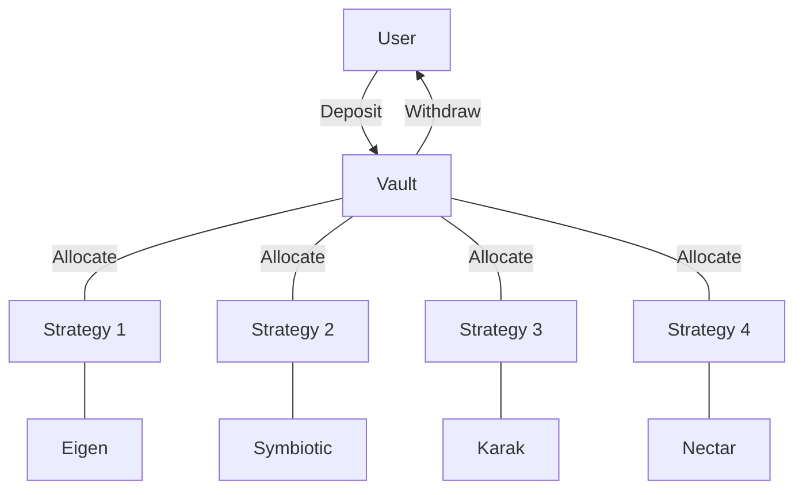
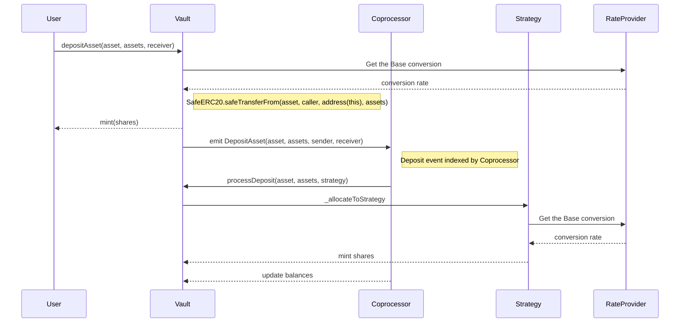
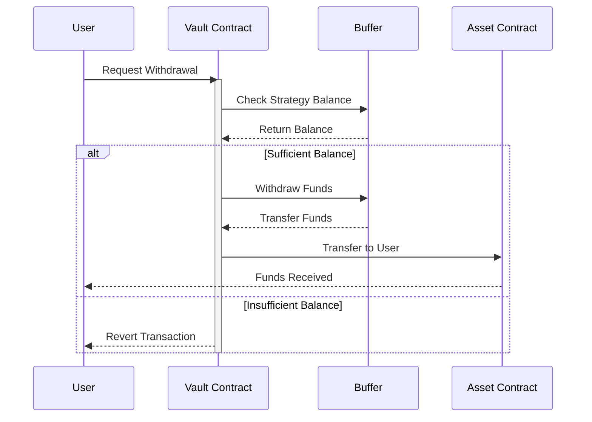

Max Vault Architecture
---

The vault architecture seamlessly integrates with restaking opportunities that return yield in crypto-native base assets. There are two types of Vault, the deposit Vault and the Strategy. YieldNest has planned to launch 5 vaults; ynETH, ynLSD, ynUSD, ynBTC and ynBNB. Vaults are 4626 compatible vaults denominated in a major base asset, such as ETH, BTC or USD. Users deposit underlying assets into the Vaults and receive share tokens. The Vaults are denominated in major base assets, but accept various underlying deriviative assets such as stETH, mETH, oETH, USDS, slisBNB, accordingly.

The Strategies live downstream of the Vaults and do the hard work of integrating with Defi protocols, such as Eigen Layer, Symbiotic, Aave, among many others. Deposits into Vaults are allocated to the Strategies which allocate to restaking protocols via  connectors.

This is a diagram of the relationship between Vaults and Strategies:

Deposits
---

The deposit process in this system is designed to efficiently manage user assets through a structured flow involving multiple components. Users initiate the process by transferring their assets to a central storage unit known as the "Vault." The Vault, which can handle multiple deposit assets, utilizes a standard method (ERC4626) to ensure compatibility with various assets. It coordinates with a Coprocessor to track deposit events and determine asset allocation strategies. The Strategy then receives and distributes these assets according to a predetermined plan, with the Rate Provider ensuring accurate conversion rates throughout the process. This comprehensive system ensures that all transactions are secure, accurately processed, and effectively managed.

### Deposit Components

1. **The Vault**:
   - The Vault is the product contract that represents shares and accounting.
   - It's a multi-asset deposit vault that converts deposited underlying assets holdings into a common share token.
   - It uses a standard method (ERC4626) to ensure compatibility accross Defi and tokenize user shares.

2. **Deposit Functions**:
   - **maxDeposit**: Returns the maximum amount of assets that can be deposited into the vault.
   - **maxMint**: Returns the maximum amount of shares that can be minted.
   - **previewDeposit**: Calculates the amount of shares that would be minted for a given amount of assets to be deposited.
   - **previewMint**: Calculates the amount of assets required to mint a given amount of shares.
   - **deposit**: Deposits assets into the vault and mints shares to the receiver.
   - **mint**: Mints shares to the receiver based on the amount of assets provided.
   - **previewDepositAsset**: Calculates the amount of shares that would be minted for a given amount of a specific asset to be deposited.
   - **depositAsset**: Deposits a specific asset into the vault and mints shares to the receiver.

3. **Coprocessor**:
   - Keeps track of deposit events and runs process functions on the vaults and strategies.
   - Calls process functions to distribute assets to different strategies.
   - Updates the Vault balances and asset prices for gas optimization.
   - Transfers a balance of assets to the Buffer Strategy for withdraws.

5. **Rate Provider**:
   - Provides the necessary prices and conversion rates for assets.

### Deposit Sequence

1. **User Transfers Assets**:
   - The user deposits their assets to the Vault as ERC20 derivatives or native tokens.

2. **Price Conversion to Base Asset**:
   - Shares are calculated from a standard base asset for easy valuation and processing.

3. **Minting Shares**:
   - Based on the converted assets, shares are allocated by minting Vault tokens.
   - This involves calculating the total assets and total supply of the Vault, converted to the base asset price.

4. **Deposit Event**:
   - An (event) is emitted when assets are deposited.
   - This event is tracked by the Coprocessor
   
5. **Coprocessing**:
   - The Coprocessor processes any idle assets and updates the Vault's records.
   - Updates asset balances the Vault holds accross the Strategies.
   - Processes Deposits by the Deposit Event.

6. **Strategy Allocation**:
   - Assets are distributed to different strategies based on currated ratios determined by governance.

Withdraws
---

The withdrawal process for Max Vaults is designed to efficiently manage the redemption of user assets while ensuring liquidity and security. The Max Vault keeps a protion in a 4626 Vault called the Buffer Strategy. This strategy is used to efficiently deploy assets and be ready to redeem should a user request a value that is less than the totalAssets of the Buffer Strategy. This sections covers the overview of how withdraws and redemptions work.

### Withdraw Components
1. **The Vault**:
   - The Vault has all strandard 4626 withdraw functions.
   - Withdraws and Redemptions are made in the base underlying asset of the vault.

2. **Buffer Strategy**:
   - The Vault requires a 4626 compliant buffer strategy to enable withdraws.
   - The buffer strategy must have the same base underlying asset as the Vault.
   - The coprocessor must allocate funds to the buffer for withdraws to function.

2. **Withdraw Functions of the Vault**:
   - **maxWithdraw**: Calculates the maximum amount of assets that can be withdrawn by a user.
   - **maxRedeem**: Calculates the maximum amount of shares that can be redeemed by a user.
   - **previewWithdraw**: Estimates the amount of shares that will be burned when a user withdraws a given amount of assets.
   - **previewRedeem**: Estimates the amount of assets that will be transferred when a user redeems a given amount of shares.
   - **withdraw**: Initiates the withdrawal process, burning shares and transferring assets to the user.
   - **redeem**: Initiates the redemption process, transferring assets to the user and burning shares.
   - **processAccounting**: Updates the Vault's accounting records, including asset balances and total assets.
   - **processAllocation**: Allocates assets to different strategies based on predefined ratios and processes transactions accordingly.

3. **Coprocessor**:
   - The coprocess should call processAllocation after deposits to make sure enough asssets get sent to buffer strategy.
   - Calls process functions to distribute assets to different strategies.
   - Updates the Vault balances and asset prices for gas optimization.

5. **Rate Provider**:
   - The Buffer strategy must be on the Rate Provider for the Vault.

### Withdraw Sequence

1. **User calls withdraw function**:
   - The user calls the withdraw function with a given amount of assets to withdraw.

2. **Check Buffer Strategy Balance**:
   - The Vault checks the Buffer Strategy for maxWithdraw and determine if withdraw amount is feasible.

3. **Burning Sequence**:
   - If the buffer has enough, it withdraws the given amount of assets to the receiver ( asset owner ).
   - The Vault burns the share amount and decrements totalAsset by amount transfer out of Buffer Strategy.

4. **Wtithdraw Event**:
   - A Withdraw Event is emitted when assets are withrdawn.
   
5. **Coprocessing**:
   - The Coprocessor must allocate assets to the buffer strategy after deposits.
   - It should call the processAccounting after withdraw to update all balances.

Rewards
---

- TODO: where does the yield come from

Incentives
---

- TODO: coprocessor incentives

Governance 
---

- TODO: add roles and governance 

